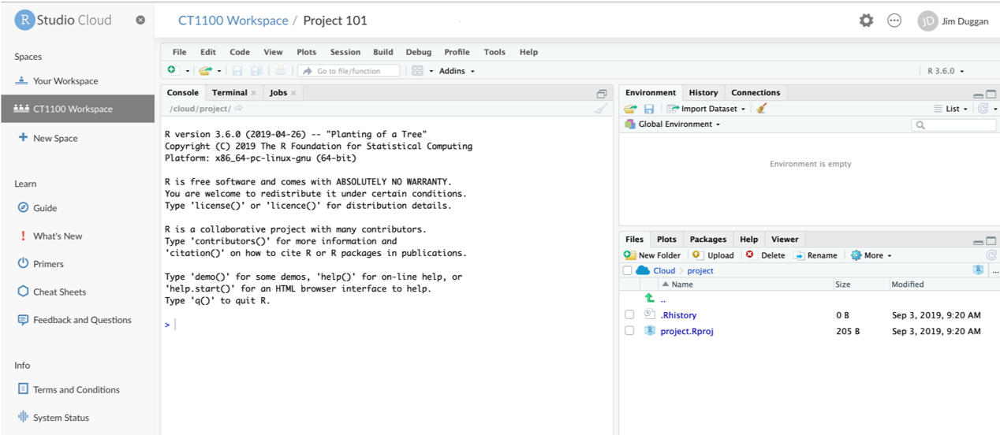
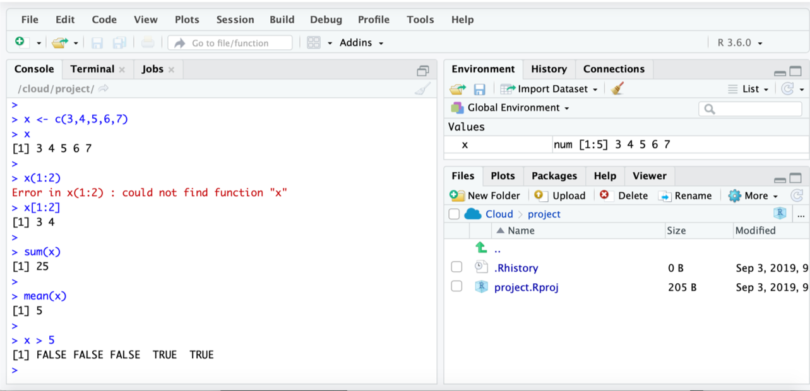

```{r setup, include=FALSE}
knitr::opts_chunk$set(echo = FALSE)
library(ggplot2)
library(readxl)
library(dplyr)
match <- read_excel("../../datasets/sport/DublinKerry19.xlsx")
```


## CT1100 Overview

- Exploring the essential building blocks of the information age
- Semester 1 (J. Duggan)
  + Data
  + Hardware
- Semester 2 (M. Rezaei)
  + Software 
  + Networks
- Module Information
  + Compulsory for all first year BA students taking IT as a subject
  + Labs from week 4 (1 hour per week, 3 time slots)
  + Worth 5 ECTS in credit
  + Covered in Semester 1 and Semester 2
  + Continuous Assessment (MCQ tests, Assigments, Lab Exam)
  + [https://github.com/JimDuggan/CT1100](https://github.com/JimDuggan/CT1100)

## Overall Plan (Semester 1)
|Lecture(s)| Topic|
|:------:|:----------|
|1 | Course Introduction|
|2 | The Processing Cycle and Binary Data|
|3 | Data in R with Atomic Vectors|
|4 | The CRAN Library and Calling Functions in R|
|5 | Tidy Data and Data Frames|
|6-7 |**ggplot2** - A Grammar of Graphics|
|8-10 |**dplyr2** - The Grammar of Data Manipulation|
|11-12 |Introduction to Hardware|


## The Processing Cycle in Computing
- Input, Process, Output key stages in computing
- Image recognition
  + Input (a photo)
  + Process (an algorithm)
  + Output (a name)

```{r, echo=F,out.width='70%'}
 
```
 
## Sample Input Data (Match Events)
```{r,echo=F}
m2 <- select(match,Time, Team, Scorer, From, Type,Points, Score)
knitr::kable(slice(m2,1:10))
``` 
 
## Processing - Summarising the Data
```{r,echo=F}
scores <- match %>% group_by(Team,Scorer) %>% summarise(Points=sum(Points)) %>%
          arrange(Team,desc(Points))
scores
```

## Processing - Analysing the Scores

```{r,echo=F}
match %>% group_by(Team,From) %>% summarise(Points=sum(Points)) %>% arrange(Team,desc(Points))
```

## Processing - Before the 34th Minute
```{r,echo=F}
filter(match,Time<=34) %>% group_by(Team,From) %>% summarise(Points=sum(Points)) %>% arrange(Team,desc(Points))
```

## Processing - After the 34th Minute
```{r,echo=F}
filter(match,Time>34) %>% group_by(Team,From) %>% summarise(Points=sum(Points)) %>% arrange(Team,desc(Points))
```


## Processing - Visualising the Data
```{r,echo=F,fig.width=6, fig.height=3.5}
ggplot(data=match,aes(x=Time,y=Score,colour=Team))+
  geom_line()+geom_point(size=2)+xlab("Minute")+ylab("Points")
```

## Data processing in R

```{r,echo=T}
x <- c(3, 4, 5, 6, 7)
x
x[1:2]
sum(x)
mean(x)
x > 5

```

## Setup an Account on rstudio.cloud

```{r, echo=F,out.width='100%'}
 knitr::include_graphics("images/02 RStudio Create.png")
```

## Create a project

```{r, echo=F,out.width='100%'}
 
```

## RStudio ready for use

```{r, echo=F,out.width='100%'}
 
```

## Run code in console. 
- x is data!
- R allows you process the data with function calls

```{r, echo=F,out.width='100%'}
 
```


## Challange 1.1 - Replicate the following in RStudio Cloud
```{r, echo=F,out.width='100%'}
 
```

## Summary
- Welcome to CT1100
- Semester 1
  + Practical focus - understanding and manipulating data
  + Using RStudio Cloud
- Next Week
  + Input - Process - Output
  + Binary data
  + More on R (atomic vectors)
  
```{r,echo=F,fig.width=2, fig.height=2}
# this is a hack to call plot but make the plot tiny
plot(1:1,axes=FALSE,xlab = "", ylab="",cex = .001)
```


