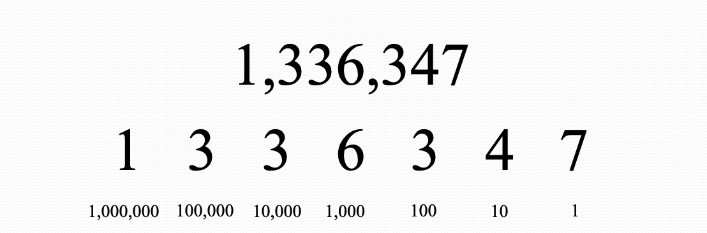
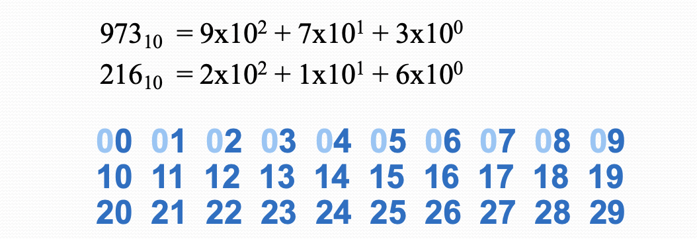
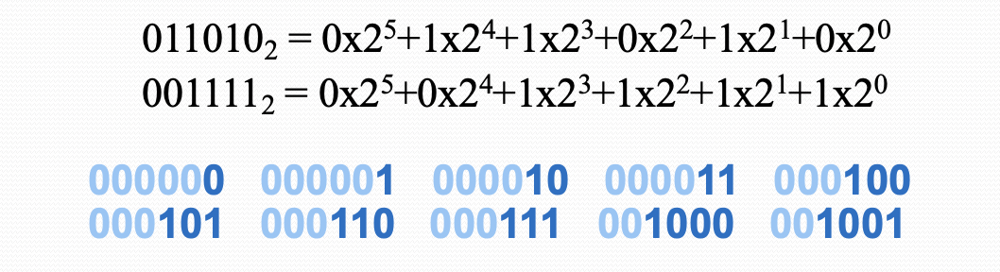
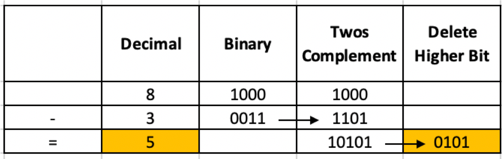
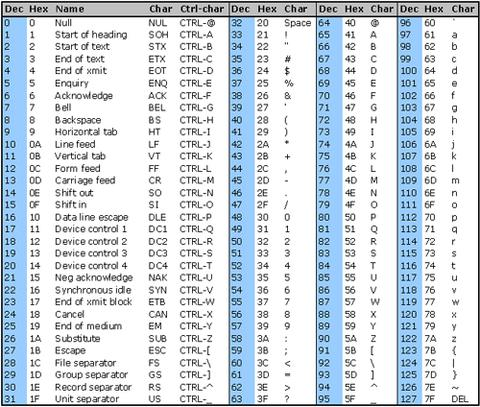
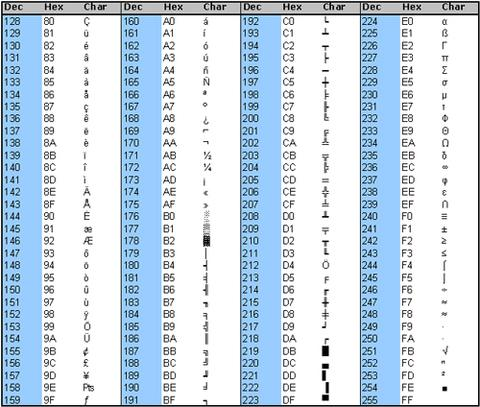

```{r setup, include=FALSE}
knitr::opts_chunk$set(echo = FALSE)
library(readxl)
library(binaryLogic)
library(dplyr)
match <- read_excel("../../datasets/sport/DublinKerry19.xlsx")
```

## Lecture Overview

- "There are 10 kinds of people in the world - those who understand binary and those who don't" (Anonymous)
- The most basic unit of information in a digital computer is called a bit **bi**nary digi**t**
- A bit is nothing more than a state of "on" or "off"
- Topics
  + Positional Numbering Systems
  + Base 10, Base 2 and Base 16
  + Conversion between bases
  + Unsigned whole numbers
  + Character Codes (ASCII and Unicode)
  
## Lecture Overview
- All numbering systems use positional notation
- Number denoted by its absolute value, multiplied by its positional value 

```{r, echo=F,out.width='100%'}
 
```
 
## Decimal Numbering Systems
- Decimal Base 10 / Radix 10
- For example 973~10~
- The set of valid numerals for a positioning numbering system is equal in size to teh radix of the system
- There are 10 digits in the decimals system (0-9), 2 in binary (0-1)
```{r, echo=F,out.width='100%'}
 
```
 
## Binary Numbering Systems
- Two valid numerals (0 and 1)
- Base 2
```{r, echo=F,out.width='100%'}
 
```

## The Scale of bits/bytes
|Size| Term|
|:------|:----------|
|Binary digit| 	bit|
|8 bits      |	byte |
|1024 (2^10^) bytes	|kilobyte|
|1,000 kilobytes|	megabyte (million bytes)|
|1,000 megabytes|	gigabyte (billion bytes)|
|1,000 gigabyte	|terabyte (trillion bytes)|
- A binary number with *N* bits can represent **unsigned integers** from 0 to 2^N^-1
- For example, 15~10~ can be represented as 1111~2~

## Challenge 2.1
- Convert 10010011~2~ to decimal
- Confirm the result with R (for example)
```{r,echo=T}
library(binaryLogic)

n1 <- as.binary(111,n = 8)
n1
```
- What is the maximum integer value (unsigned) for a 16 bit value?

## Convert decimal to ternary
- Division/remainder technique, e.g. 104~10~ to base 3
- 104 / 3 = 34 with a remainder of 2
- 34 / 3 = 11 with a remainder of 1
- 11 / 3 = 3 with a remainder of 2
- 3/3  = 1 with a remainder of 0
- 1/3  = 0, with a remainder of 1
- Reading the remainders from bottom to top we have 104~10~ = 10212~3~

## Challenge 2.2
- Convert 15~10~ to binary
- Confirm the result with R
```{r,echo=T}
library(binaryLogic)

n1 <- as.binary(15,n = 4)

```

## Binary Addition
- Facts for binary addition
  + 0 + 0 = 0
  + 0 + 1 = 1
  + 1 + 0  = 1 
  + 1 + 1 = 0  ‘and carry 1’ = 10
  + 1 + 1 + [carry] = 1 ‘and carry 1’
- Need to make sure there is enough space (otherwise "overflow")

```{r, echo=F,out.width='100%'}
 
```

## Binary Subtraction
- Our desire with computer arithmetic is to minimise the types of operations required
  + so we have devised a way to subtract using addition!
- We do this using complementary arithmetic
  + instead of a - b, think of a + (-b)
  + we find a way to express a number as negative, then add it 
- To express a binary number as negative, get the *twos complement*
  + flip the bits and add 1
  + Then add, and throw away any high order bits
```{r, echo=F,out.width='80%'}
 
```


## Challenge 2.3
- Add 4~10~ and 11~10~ in binary
- Subtract 8~10~ from 15~10~

## Representing Text
- ASCII 
  + American Standard Code for Information Interchange
  + 8-bit, limited character set - built around Latin alphabet
  + 32 control characters, 10 digits, 52 letters (upper & lower), 32 special characters and the space character.
- Unicode
  + attempts to represent characters in every language
  + Uses 16 bits per character and is a superset of ASCII

## [ASCII Codes (0-127)](https://www.commfront.com/pages/ascii-chart)

```{r, echo=F,out.width='70%'}
 
```

## [ASCII Codes (128-255)](https://www.commfront.com/pages/ascii-chart)

```{r, echo=F,out.width='70%'}
 
```

## Challenge 2.4
Show that the following code makes sense, by converting the hexadecimal numbers to decimal.
```{r,echo=T}
charToRaw("Hello World")
```

## Unicode

|Types| Description| # Chars | Hex Vals|
|:------:|:----------|:----------:|:----------:|
|Alphabets|Latin, Cyrillic, Greek etc.|8192|0000-1FFF|
|Symbols|Dingbats, Mathematical etc.|4096|2000-2FFF|
|CJK|Chinese, Japenese, Korean|40,960|4000-DFFF|
|Han|Unified Chinese, Japenese, Korean|4096|3000-3FFF|
|   |Expansion/spillover from Han|4096|E000-EFFF|
|User defined|Unified Chinese, Japenese, Korean|4095|F000-FFFE|

## Challenge 2.5
What kind of data might each of these variables be?
```{r,echo=F}
m2 <- select(match,Time, Team, Scorer, From, Type,Points, Score)
knitr::kable(slice(m2,1:10))
``` 
 


## Summary
- Key ideas
  + Positional numbering systems
  + Base 10, 16 and 2
  + Conversion processes
  + Addition & Subtraction of unsigned integers
  + Character codes
- Other Topcics
  + Signed integers and negative numbers
  + Floating point representation
  + Multiplication and division
  + [IEEE Floating Point Standard](https://www.geeksforgeeks.org/ieee-standard-754-floating-point-numbers/)
+ Next steps
  - High level languages hides many of these details
  - Easier to work with numbers and characters
  - We will explore these in R, e.g. variable types in a **tibble**

  
```{r,echo=F,fig.width=2, fig.height=2}
# this is a hack to call plot but make the plot tiny
plot(1:1,axes=FALSE,xlab = "", ylab="",cex = .001)
```


