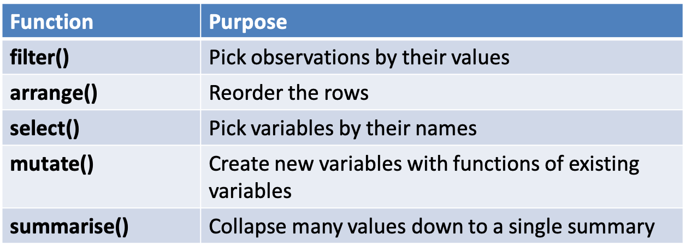

```{r setup, include=FALSE}
knitr::opts_chunk$set(echo = FALSE)
library(ggplot2)
library(dplyr)
```

## Overview

- Visualisation is an important tool for insight generation, but it’s rare that you get the data in exactly the right form you need” (Wickham and Grolemund 2017)
  + Create new variables
  + Create summaries
  + Order data
- dplyr package is designed for data transformation

## dplyr

- All verbs (functions) work similarly
- The first argument is a data frame/tibble
- The subsequent arguments decide what to do with the data frame
- The result is a data frame (supports chaining of steps)

```{r, echo=F,out.width='100%'}
 
```

## Sample Data set ggplot2::mpg
```{r}
glimpse(mpg)
```

## (1) **filter()**
- Subset observations based on their values. 
- First argument the name of the data frame
- Subsequent arguments are expressions that filter the data frame
- Only includes rows that have no missing values

```{r, echo=T}
filter(mpg,manufacturer=="audi",year==1999,model=="a4")
```

## Cars with highest mpg, lowest mpg?

```{r, echo=T}
filter(mpg,hwy==max(hwy))
filter(mpg,hwy==min(hwy))
```

## Challenge 2.1

- List the cars with an average city mpg greater than the median.
- Show the cars with the maximum displacement

## (2) **arrange()**
- Changes the order of rows. 
- Takes a data frame and a set of column names to order by

```{r, echo=T}
arrange(mpg,displ)
```

## Show in descending order

```{r, echo=T}
arrange(mpg,desc(displ))
```

## Add an extra sort column

```{r, echo=T}
arrange(mpg,desc(year),desc(displ))
```

## The pipe operator

- The pipe %>% comes from the magrittr package (Stefan Milton Bache)
- Helps to write code that is easier to read and understand
  + x %>% f(y) turns into f(x, y)
```{r, echo=T}
mpg %>% select(model,displ,cty) %>% slice(1:2)
```


## Summary One
- dplyr - a grammar of data manipulation
- Five verbs
  + **filter()**
  + **arrange()**
- Usefully combined with **%>%** operator

```{r,echo=F,fig.width=2, fig.height=2}
# this is a hack to call plot but make the plot tiny
plot(1:1,axes=FALSE,xlab = "", ylab="",cex = .001)
```


