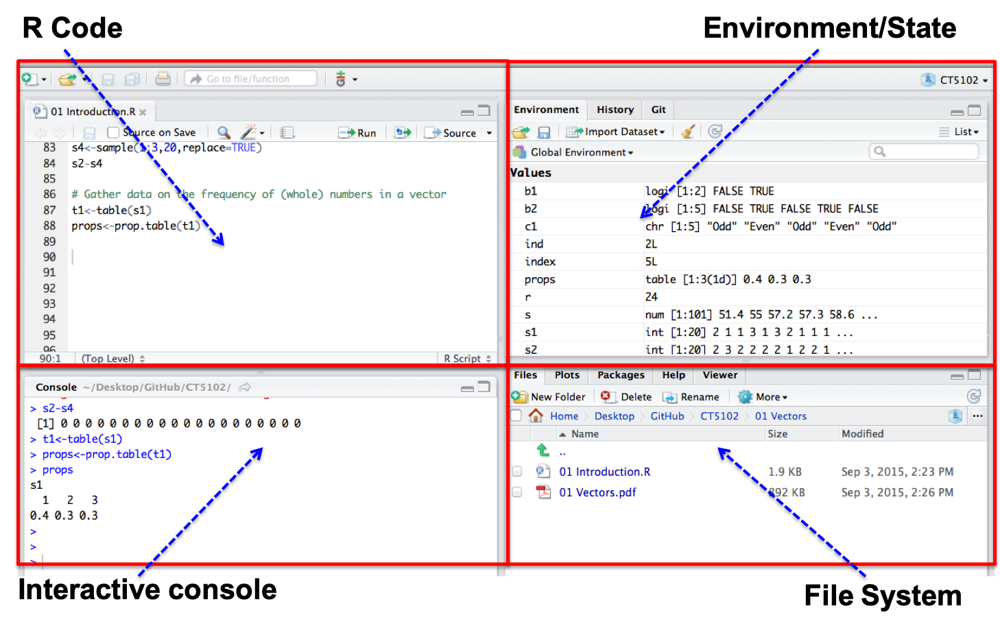
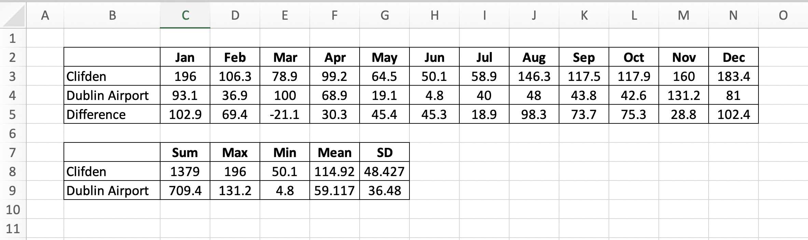

```{r setup, include=FALSE}
library(readxl)
knitr::opts_chunk$set(echo = FALSE)
match <- read_excel("../../datasets/sport/DublinKerry19.xlsx")
clifden <- c(196.0, 106.3,  78.9,  99.2, 64.5,   50.1, 
              58.9, 146.3, 117.5, 117.9, 160.0, 183.4)
names(clifden) <- c("Jan","Feb","Mar","Apr","May","Jun",
                    "Jul","Aug","Sep","Oct","Nov","Dec")

dublin_air <- c(93.1,	36.9,	100.0,	68.9,	 19.1,	 4.8,	
                40.0,	48.0,	 43.8,	42.6,	131.2,	81.0)
names(dublin_air) <- c("Jan","Feb","Mar","Apr","May","Jun",
                       "Jul","Aug","Sep","Oct","Nov","Dec")
```


## R

- R’s mission is to enable the best and most thorough exploration of data possible (Chambers 2008). 
- It is a dialect of the S language, developed at Bell Laboratories
- ACM noted that S “will forever alter the way people analyze, visualize, and manipulate data” 

```{r,echo=T}
v <- 1:10
v
summary(v)
```

## R Studio IDE (also available through https://rstudio.cloud)

```{r, echo=F,out.width='90%'}
 
```
 
## Data Structures in R
 
|| Homogenous| Heterogenous |
|:------|:----------|:-----------|
|1d | **Atomic Vector**|List |
|2d | Matrix|Data Frame/Tibble|
|nd | Array| |

- The basic data structure in R is the Vector
- Vectors come in two flavours: 
  + Atomic vectors
  + Lists
- With atomic vectors, all elements have the same type: logical, integer, double (numeric) or character


## Atomic Vectors - Examples

```{r,echo=T}
dbl_var <- c(2.9, 3.1, 4.8)
dbl_var

log_var <- c(TRUE, TRUE, FALSE, TRUE, FALSE)
log_var

str_var <- c("Dublin", "London", "Edinburgh")
str_var

```

## Useful Comparison - Excel
- Atomic vectors are similar to rows/columns in Excel
- Think of them as adjacent cells of data that can be processed
```{r, echo=F,out.width='100%'}
 
```
  
```{r,echo=T}
dublin_air
```
  
## Summary of data

```{r, echo=F,out.width='100%'}
 
```
  
```{r,echo=T}
summary(dublin_air)
summary(clifden)
```
    
## Subsetting Atomic Vectors
- Subsetting data is a key activity in data science
- R’s subsetting operators are powerful and fast
- For atomic vectors, the operator [ is used
- In R, the index for a vector starts at 1

```{r,echo=T}
dublin_air[1]
dublin_air[1:6]
```

## Subsetting Vectors - (1) Positive Integer
Positive integers return elements at the specified position

```{r,echo=T}
clifden[10]
clifden[3:6]
```

## Subsetting Vectors - (2) Using character vectors
Return elements with matching names
```{r,echo=T}
clifden[1:6]
clifden["Apr"]
clifden[c("Apr","Jan")]
```

## Vectorisation
- A powerful feature of R is that it supports vectorisation
- For example, we can subtract two vectors - just like Excel.

```{r, echo=F,out.width='100%'}
 
```
  
```{r,echo=T}
clifden[1:9] - dublin_air[1:9]
```
    
## Logical Vectors
- Logical vectors can be generated using conditional expressions, and for filtering

```{r,echo=T}
mean(clifden)
clifden1 <- clifden[1:6]
clifden1 > mean(clifden)
clifden1[clifden1 > mean(clifden)]
```

## Summary
- Atomic vectors, a key type in R. Very similar to rows/columns (Nx1 or 1xN) of data in Excel
- All elements are the same type (coercion)
- Different ways to filter, including logical vectors
- A data frame can be viewed as a set of atomic vectors bound together
```{r,echo=T}
head(match)
```

```{r,echo=F,fig.width=2, fig.height=2}
# this is a hack to call plot but make the plot tiny
plot(1:1,axes=FALSE,xlab = "", ylab="",cex = .001)
```


