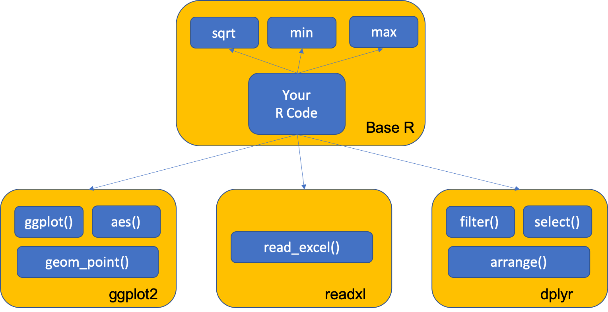
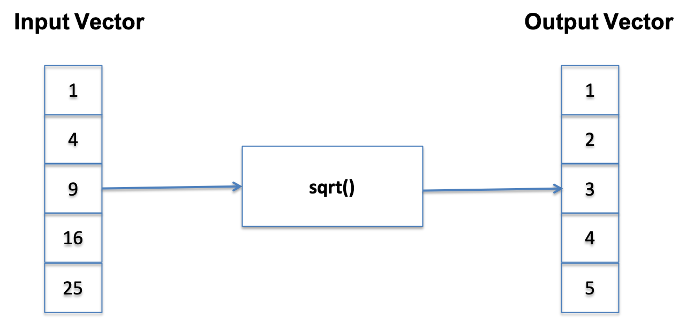

```{r setup, include=FALSE}
knitr::opts_chunk$set(echo = FALSE)
library(ggplot2)
library(dplyr)
```

## Functions
- A function is a group of instructions (with a name) that:
  + takes input(s)
  + uses the input(s) to compute other value, and 
  + returns a result (Matloff 2009)
  + result usually stored in a variable
- Functions are a fundamental building block of R
- Users of R should adopt the habit of creating simple functions which will make their work more effective and also more trustworthy (Chambers 2008). 
- Two approaches:
  + Use R functions (Base R and other packages)
  + Write your own functions

## R - A function "ecosystem"
John Chambers: “To understand computations in R, two slogans are helpful:

- Everything that exists is an object.
- Everything that happens is a **function call.**"
  
```{r,echo=T}
x <- 1:6
sqrt(x)
min(x)
mean(x)
```

## Coding with functions
- "Stand on the shoulders of giants"
- Use Tools -> Install Packages from RStudio


```{r, echo=F,out.width='90%'}
 
```
 

## Calling functions: input - process - output

```{r,echo=T}
x <- c(1,4,9,16,25)
sqrt(x)
```

```{r, echo=F,out.width='90%'}
 
```
 
 
## Challenge 4.1
- Use the sample function to generate 30 random numbers between 50 and 100 and call the function set.seed(100) before you call sample
- Use R functions to calculate the mean, max and min
- Show all the numbers greater that the mean
- Use length() to count the number great that the mean

```{r,echo=T}
set.seed(100)
x <- sample(30:100,30,replace=T)
x[1:12]
```

## Function Arguments
- It is useful to distinguish between  formal arguments and the actual arguments
  + Formal arguments are the property of the function
  + Actual arguments can vary each time the function is called.
- When calling functions, arguments can be specified by
  + Position
  + Complete name
- Guidelines (Wickham 2015)
  + Use positional mapping for the first one or two arguments (most commonly used)
  + Avoid using positional mapping for less commonly used attributes
  + Named arguments should always come after unnamed arguments
  

## Fuel Economy Data Set (ggplot2::mpg)

This dataset contains a subset of the fuel economy data that the EPA makes available on http://fueleconomy.gov. It contains only models which had a new release every year between 1999 and 2008 - this was used as a proxy for the popularity of the car.

|**manufacturer**| car manufacturer| **drv** | drive type |
|:------|:----------|:-----------|:-----------|
|**model**| model name| **cty** | city miles per gallon |
|**displ**| engine disp (l)| **hwy** | highway miles per gallon |
|**year**| year of make| **fl** | fuel type |
|**cyl**| number of cylinders| **class** |  "type" of car|
|**trans**| type of transm.| | |

## Data Set Elements

```{r,echo=F}
knitr::kable(
  slice(ggplot2::mpg[,1:8],1:10)
)
```


## Calling a function to create a plot (from package ggplot2)
```{r,echo=T,fig.width=6, fig.height=2.6}
library(ggplot2)
ggplot(data=mpg)+
  geom_point(mapping=aes(x=displ,y=cty))
```

## Calling functions to filter data
```{r,echo=T,fig.width=6, fig.height=2.6}
library(ggplot2)
library(dplyr)
f <- mpg %>% select(manufacturer,model,year,displ,cty) %>% 
             filter(model=="a4") %>% arrange(desc(year))
f
```


## Writing Functions
- **function** (*arguments*) *expression*
- arguments gives the arguments, separated by commas.
- Expression (body of the function) is any legal R expression, usually enclosed in { }
- Last evaluation is returned
- return() can also be used, but usually for exceptions.

```{r,echo=T}
f <- function(x)x^2 # this function squares a vector
f(1:3)
``` 

## Summary
- Functions are a fundamental building block of R
- Functions:
  + are declared using the function reserved word 
  + are objects
- Functions can access variables within the environment where they are created
- Functionals are functions that takes a function as an input and returns a vector as output (can be used as a looping structure)
- The apply family in R are functionals (**apply**, **sapply**, **lapply**)

```{r,echo=F,fig.width=2, fig.height=2}
# this is a hack to call plot but make the plot tiny
plot(1:1,axes=FALSE,xlab = "", ylab="",cex = .001)
```


