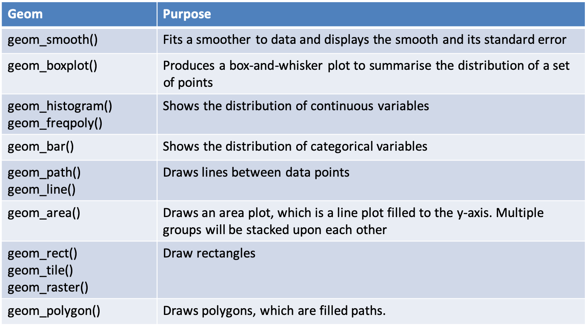
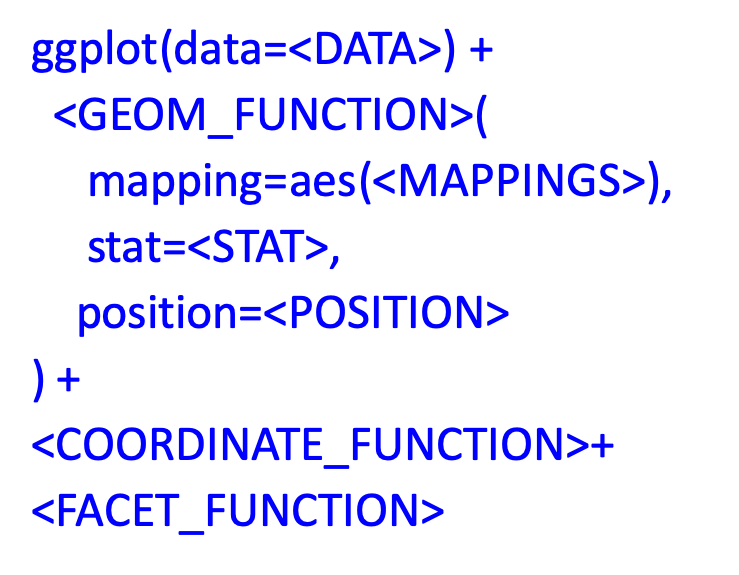

```{r setup, include=FALSE}
knitr::opts_chunk$set(echo = FALSE)
library(ggplot2)
library(dplyr)
d <- ggplot2::mpg
```

## Data Exploration

“Data exploration is the art of looking at your data, rapidly generating hypotheses, quickly testing them, then repeating again and again and again.” (Wickham and Grolemund 2017).

```{r, echo=F,fig.width=4, fig.height=1.8}
ggplot(data = mpg) +   # specify the source tibble
  geom_point(mapping=aes(x=displ,  # map x, y vars
                         y=hwy,
                         colour=class))
```


## Facets
- Another way to add categorical variables is to split a plot into facets, subplots that display one subset of the data.
- To facet your plot by a single variable, use facet_wrap(), with ~ followed by the variable name


## Facet Example 1
```{r,echo=T,fig.width=4.5, fig.height=2.5}
ggplot(data=d)+
  geom_point(aes(x=displ,y=hwy))+
  facet_wrap(~class)
```

## Facet Example 2
```{r,echo=T,fig.width=4.5, fig.height=2.5}
ggplot(data=d)+
  geom_point(aes(x=displ,y=hwy,colour=class))+
  facet_wrap(~manufacturer)
```


## Geoms
- A geom is a geometrical object that a plot uses to represent data
- Bar charts use bar geoms, line charts use line geoms, and scatter plots use the point geom.
- To change the geom in your plot, simply change the geom function that is added to the ggplot call.

## geom_point()
```{r,echo=T,fig.width=4.5, fig.height=2.5}
ggplot(data=d)+
  geom_point(aes(x=displ,y=hwy))
```


## Sample plot geoms
```{r, echo=F,out.width='90%'}
 
```

## Diamonds Data Set
A dataset containing the prices and other attributes of almost 54,000 diamonds

```{r,echo=F}
knitr::kable(
  slice(ggplot2::diamonds,1:10),
  caption="Selected sample from diamonds data set"
)
```


## Explanation of Variables

```{r, echo=F,out.width='100%'}
 knitr::include_graphics("images/03 Diamonds.png")
```


## Diamonds summary
```{r, echo=F,out.width='100%'}
 knitr::include_graphics("images/04 Summary.png")
```

## Statistical Transformations
- Many graphs, like scatterplots, plot the raw values of the dataset

- However, other graphs (e.g. bar charts) calculate new values to plot
  + Bar charts, histograms and frequency polygons bin your data and plot bin counts, the number of points that fall in each bin
  + Smoothers fit a model to your data and the plot predictions from the model
  + Boxplots compute a robust summary of the distribution and display a specially formatted box

## Bar Chart

```{r,echo=T,fig.width=4.5, fig.height=2.5}
ggplot(data=diamonds)+
  geom_bar(aes(x=cut))
```

## Bar Chart: Adding information with fill

```{r,echo=T,fig.width=4.5, fig.height=2.5}
ggplot(data=diamonds)+
  geom_bar(aes(x=cut,fill=clarity))
```


## Additional Adjustment
- Recall our first scatterplot
- 126 points displayed, yet there are 234 observations
- Many points can overlap, so it makes it hard to see where the mass of data is
- Are all points spread equally, or is there one special combination that contains 129 values?
- “jitter” adds random noise to each point

## Using jitter

```{r,echo=T,fig.width=4.5, fig.height=2.5}
ggplot(data=mpg)+
  geom_point(aes(x=displ,y=hwy),
           colour="blue", position="jitter")
```

## Histogram

```{r,echo=T,fig.width=5, fig.height=2.5}
ggplot(data=diamonds,aes(x=price))+
  geom_histogram(binwidth = 500)
```


## Summary
- The ggplot2 approach can be summarised by a template
- It can take seven parameters, but usually not all need to be applied (defaults used)
- These seven parameters comprise the **grammar of graphics**

```{r, echo=F,out.width='50%'}
 
```

```{r,echo=F,fig.width=2, fig.height=2}
# this is a hack to call plot but make the plot tiny
plot(1:1,axes=FALSE,xlab = "", ylab="",cex = .001)
```


