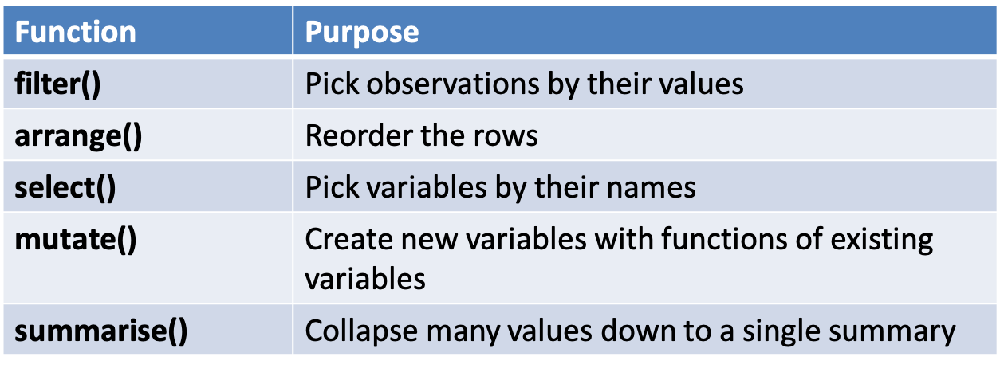
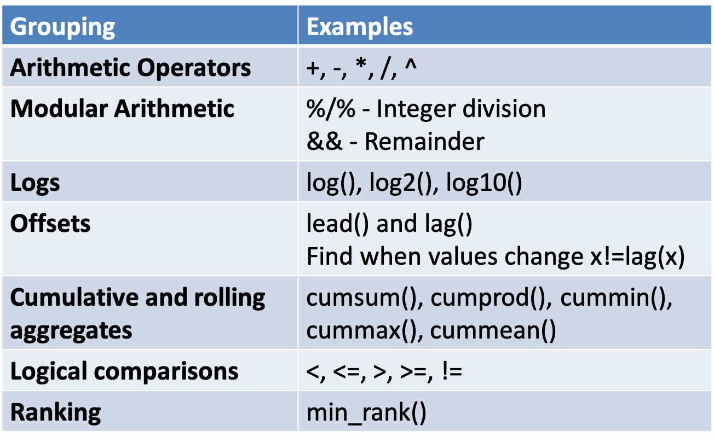

```{r setup, include=FALSE}
knitr::opts_chunk$set(echo = FALSE)
library(ggplot2)
library(dplyr)
```


## dplyr

- All verbs (functions) work similarly
- The first argument is a data frame/tibble
- The subsequent arguments decide what to do with the data frame
- The result is a data frame (supports chaining of steps)

```{r, echo=F,out.width='100%'}
 
```


## (3) **select()**
- It is not uncommon to get datasets with hundreds, or even thousands, of variables
- A challenge is to narrow down on the variables of you’re interested in
- select() allows you to rapidly zoom in on a useful subset using operations based on the variable names

```{r, echo=T}
select(mpg,model,year,displ, cty, hwy)
```

## Special Function with select
```{r, echo=F,out.width='100%',fig.cap='Specical functions with select'}
 knitr::include_graphics("images/07 select.png")
```

## (4) **mutate()**
- It is often useful to add new columns that are functions of existing columns
- mutate() always adds new columns at the end of your data set.

```{r, echo=T}
sml <- select(mpg,model,displ,cty)
sml <- mutate(sml,Category=ifelse(cty>mean(cty),"AboveAvr","BelowAvr"))
sml
```

## Useful creation functions
- There are many functions for creating new variables that can be used with mutate()
- The key property is that the function must be vectorised:
  + It must take a vector of values as input, and,
  + Return a vector with the same number of values as output
```{r, echo=F,out.width='80%',fig.cap='Creation functions with mutate()'}
 
```


## Summary Two
- dplyr - a grammar of data manipulation
  + **select()**
  + **mutate()**
- Usefully combined with **%>%** operator

```{r,echo=F,fig.width=2, fig.height=2}
# this is a hack to call plot but make the plot tiny
plot(1:1,axes=FALSE,xlab = "", ylab="",cex = .001)
```


