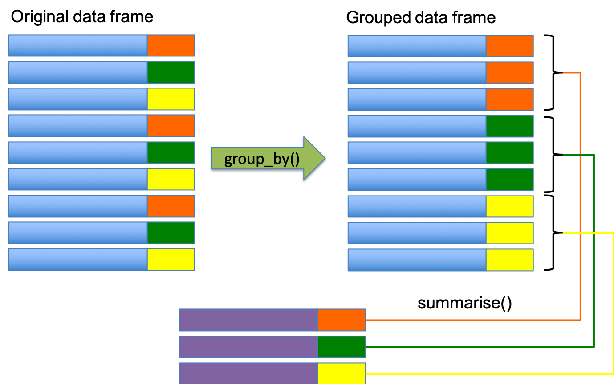
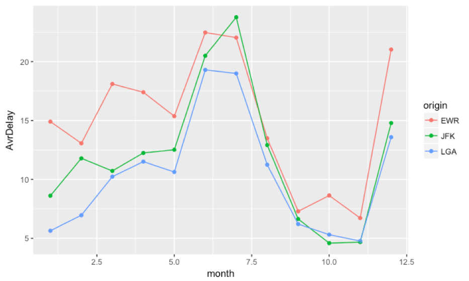

```{r setup, include=FALSE}
knitr::opts_chunk$set(echo = FALSE)
library(ggplot2)
library(dplyr)
```


## dplyr

- All verbs (functions) work similarly
- The first argument is a data frame/tibble
- The subsequent arguments decide what to do with the data frame
- The result is a data frame (supports chaining of steps)

```{r, echo=F,out.width='100%'}
 knitr::include_graphics("images/06 dplyr.png")
```


## (5) **summarise()**
- The last key verb is summarise()
- It collapses a data frame into a single row
- Not very useful unless paired with group_by()
- Very useful to combine with the pipe operator %>%
- The pipe %>% comes from the magrittr package (Stefan Milton Bache)
- Helps to write code that is easier to read and understand
  + x %>% f(y) turns into f(x, y)
```{r, echo=T}
mpg %>% select(model,displ,cty) %>% slice(1:2)
```

## The function **group_by()**
- Most summary data operations are useful done on groups defined by variables in the the dataset.
- The group_by function takes an existing tbl and converts it into a grouped tbl where operations can then performed "by group”.

```{r, echo=T}
gr <- group_by(mpg,year)
agg <- summarise(gr,AverageCty=mean(cty))
agg
```

## Using %>%

```{r, echo=T}
mpg %>% group_by(manufacturer)            %>% 
        summarise(AvrCty=mean(cty),N=n()) %>%
        arrange(desc(AvrCty))             %>%
        slice(1:5)
```

## Overall idea
```{r, echo=F,out.width='85%'}
 
```

## Useful Summary Functions
```{r, echo=F,out.width='100%'}
 knitr::include_graphics("images/12 Functions.png")
```

## The package nycflights13
```{r, echo=T}
glimpse(nycflights13::flights)
```

## Challenge 2.2 | nycflights13::flights
Generate the following graph. Use the variable **dep_delay**. The variable **origin** indicates the departure airport.
```{r, echo=T}
unique(nycflights13::flights$origin)
```

```{r, echo=F,out.width='65%'}
 
```

## Overall Summary
- dplyr - a grammar of data manipulation
- Five verbs
  + **filter()**
  + **arrange()**
  + **select()**
  + **mutate()**
  + **summarise()** (along with **group_by()**)
- Usefully combined with **%>%** operator

```{r,echo=F,fig.width=2, fig.height=2}
# this is a hack to call plot but make the plot tiny
plot(1:1,axes=FALSE,xlab = "", ylab="",cex = .001)
```


